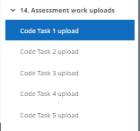
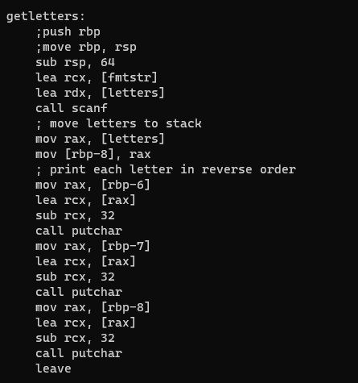
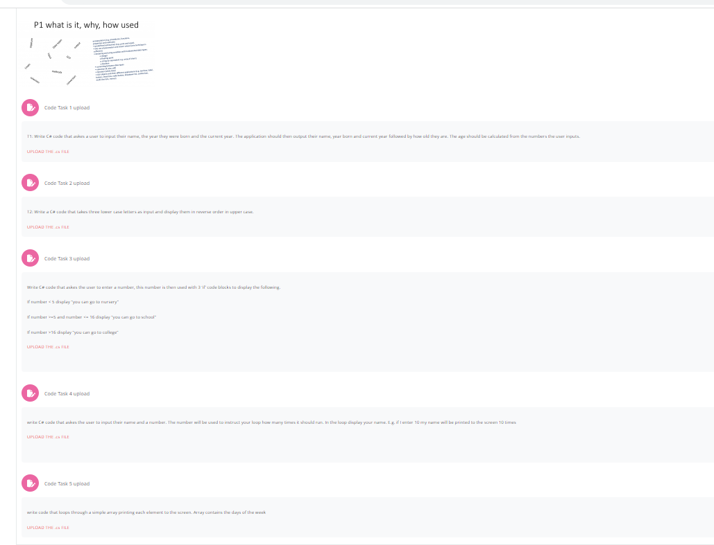

## My (horrible) attempt at completing the questions on moodle in x64 assembly
 

 Section 14 on moodle contains a collection of problems to be solved in c#. This is my attempt to write solutions for each in x64 assembly language.
I have tested each program and they should function as intended albeit without any serious error handling or optimization. I am sure this is both horrible code and terible practice but at least they run! I compiled on windows with [nasm](https://www.nasm.us/) and linked with visual studio's linker. The compiled programs are availible in the directory [build](build) but each asm file can be compiled with `nasm -f win64 -o [name.obj] [name.asm]` and linked (from the visual studio developer command line or powershell with `link [programname.obj] /defaultlib:ucrt.lib /defaultlib:msvcrt.lib /defaultlib:legacy_stdio_definitions.lib /defaultlib:Kernel32.lib /defaultlib:Shell32.lib /nologo /incremental:no` The single c file can be compiled with any c compiler that supports c99. I used clang on windows but msvc, gcc, or any other will do.

### Taken from Section 14 on moodle in the Problem Solving Skills for IT 

The programs are numbered according to the problems:

1:
-   Write C# code that askes a user to input their name, the year they were born and the current year. The application should then output their name, year born and current year followed by how old they are. The age should be calculated from the numbers the user inputs.
2:
-    Write a C# code that takes three lower case letters as input and display them in reverse order in upper case.
3:
-   Write C# code that askes the user to enter a number, this number is then used with 3 ‘if’ code blocks to display the following.

    If number < 5 display “you can go to nursery”

    If number >=5 and number <= 16 display “you can go to school”

    If number >16 display “you can go to college”
4:
-   write C# code that askes the user to input their name and a number. The number will be used to instruct your loop how many times it should run. In the loop display your name. E.g. if I enter 10 my name will be printed to the screen 10 times 
5:
-   write code that loops through a simple array printing each element to the screen. Array contains the days of the week

The files are named silly1.asm, silly2.asm, silly3.asm, silly4.asm, and silly5.c respectively.

